## Excel для анализа данных
---------------------------
### Оглавление
- [О проекте](#о-проекте)
- [Кейс 1: Количественные и качественные данные](#кейс1)
- [Кейс 2: Среднее, медиана, стандартное и нормированное отклонение](#кейс2)
- [Кейс 3: Распределение вероятностей](#кейс3)
- [Кейс 4: Регрессионный, дисперсионный, корреляционный анализ](#кейс4)
- [Кейс 5: Проверка гипотез](#кейс5)

### О проекте
В проекте реализовано 5 прикладных исследований по статистическому анализу данных в Excel.

### Кейс 1: Количественные и качественные данные
Задача: исследование методов обработки различных данных.

Метод: группировка качественных данных (категории, поставщики) с построением круговых диаграмм; для количественных данных (цена, количество, скидка) - расчет интервалов по формуле Стерджесса, вычисление абсолютной и относительной частоты, построение гистограмм.

Результат: выявление распределения товаров: большую часть ассортимента составляют продукты и напитки. Цены сгруппированы в 4 интервала, большинство товаров (60%) попадают в диапазон 40–130 руб.

Круговая диаграмма для категорий.
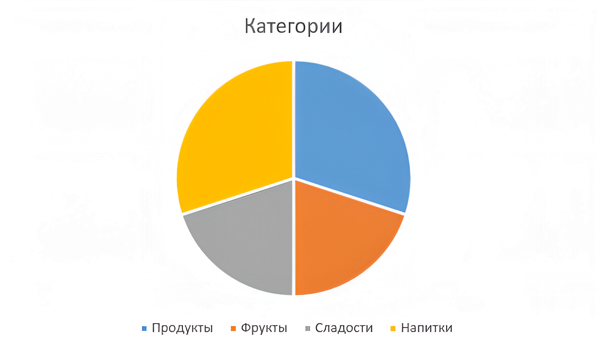

Диаграмма для поставщиков.
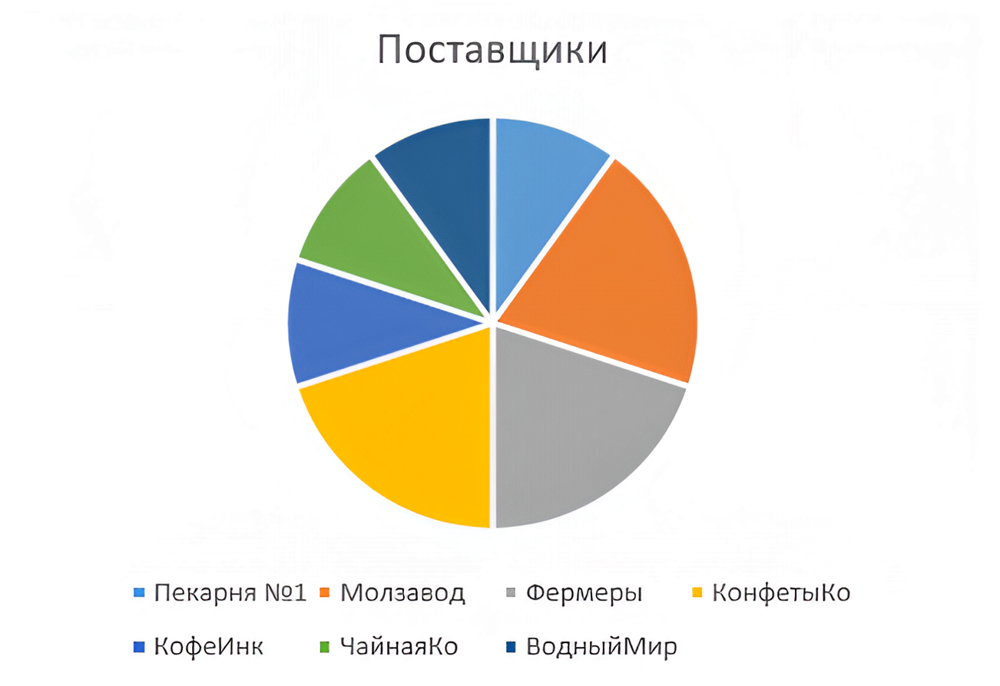

Гистограмма для цены.
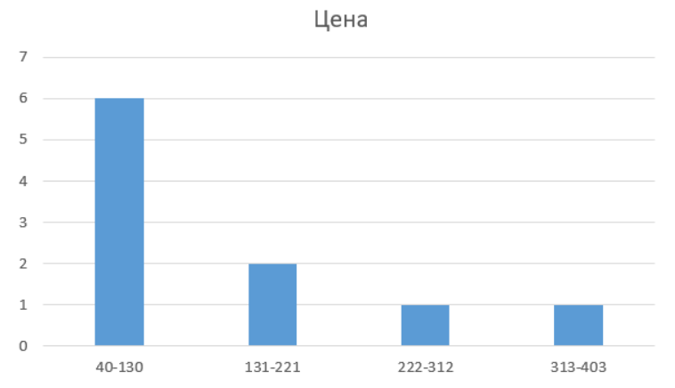

Гистограмма для количества.
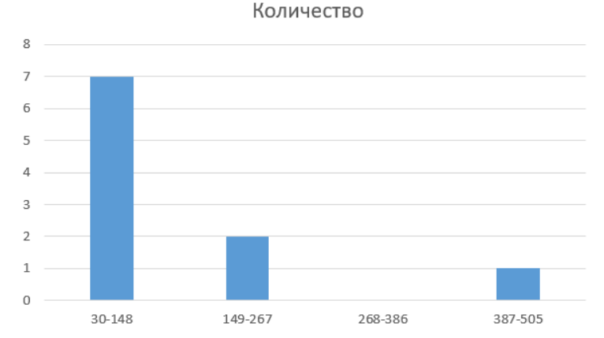

Гистограмма для скидки.
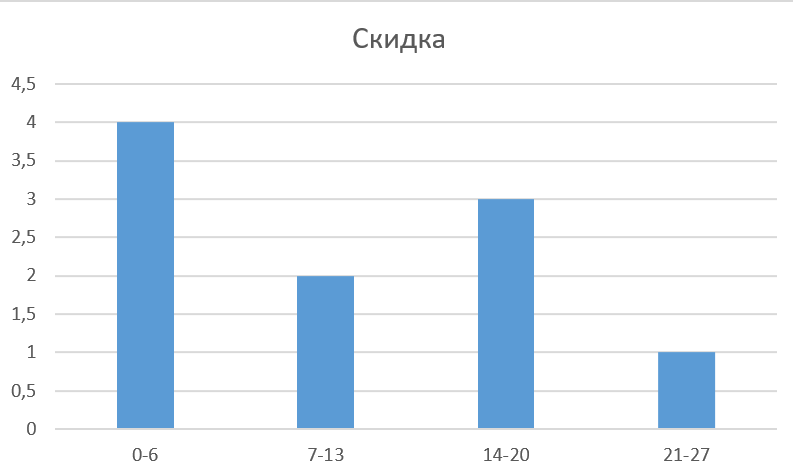
### Кейс 2: Среднее, медиана, стандартное и нормированное 
Задача: изучить статистические метрики и функции Excel.

Метод: расчет среднего значения (СРЗНАЧ), медианы (МЕДИАНА), стандартного отклонения (СТАНДОТКЛОН.В) и нормированного отклонения/Z-оценки (НОРМАЛИЗАЦИЯ) для трех переменных: цена, количество, скидка.

Результат: цены имеют высокую вариативность (станд.откл. = 120 руб., среднее = 150 руб.), что говорит о сильном разбросе. Два товара (шоколад, кофе) имеют Z-оценку > 2, что указывает на потенциальные аномалии. 

Таблица среднего значения, медианы, стандартного отклонения для
цены, количества и скидки.
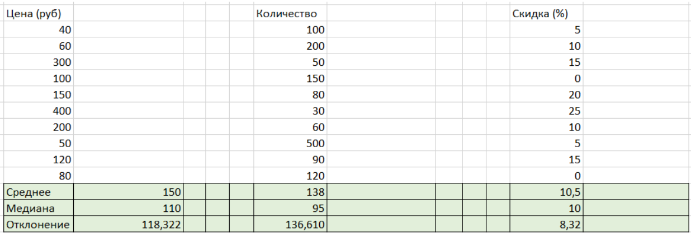

Таблица нормированного отклонения для цены, количества и скидки.
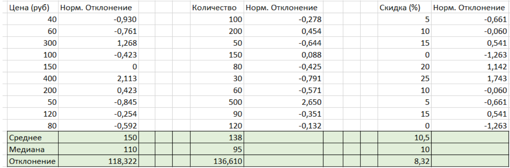
### Кейс 3: Распределение вероятностей
Задача: изучение семейства функций распределения, применение функций распределения.

Метод: расчет нормального распределения через НОРМ.РАСП(), стандартного нормального - через НОРМ.СТ.РАСП(), распределения хи-квадрат - через ХИ2.РАСП(), распределения Стьюдента - через СТЬЮДЕНТ.РАСП(), критерия Фишера - через ФИШЕР() (для значений <1) и ФИШЕРОБР() (для ≥1). Уровень значимости = 0.05, степени свободы = 5.

Результат: получены значения плотностей вероятности для каждого распределения. Критерий Фишера для большинства наблюдений близок к 0.8–0.9.

Найденные значения нормального распределения.
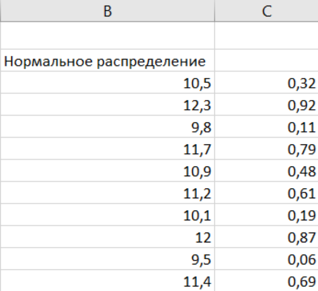

 Найденные значения стандартного нормального распределения.
 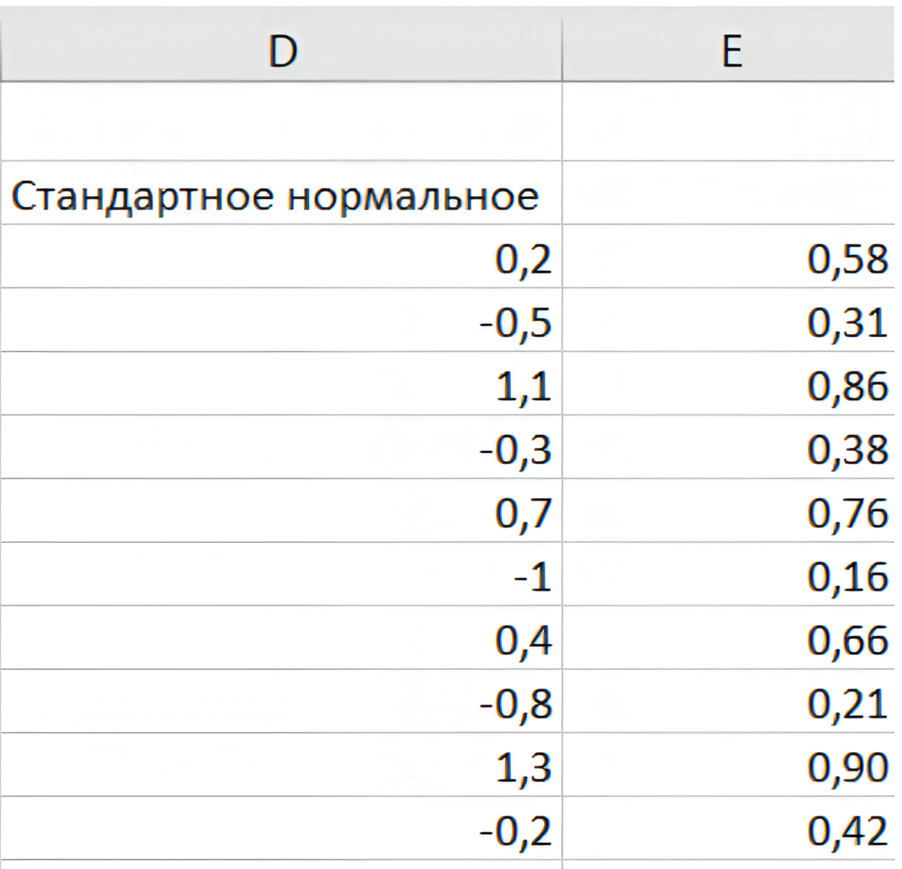

 Найденные значения распределения хи-квадрат.
 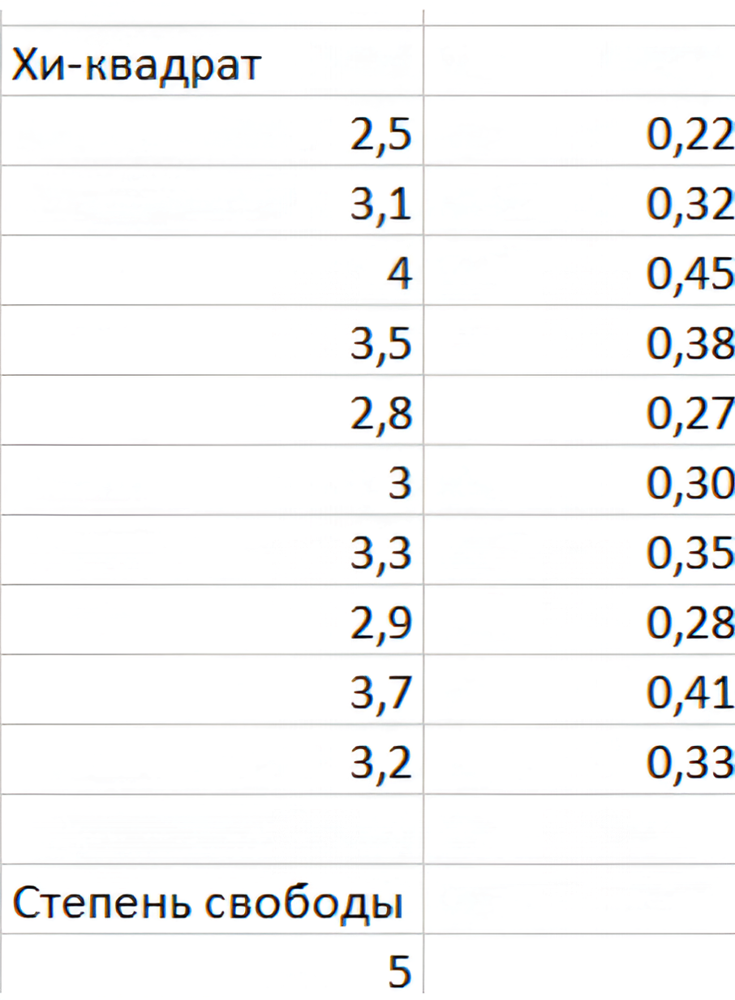

  Найденные значения распределения Стьюдента.
 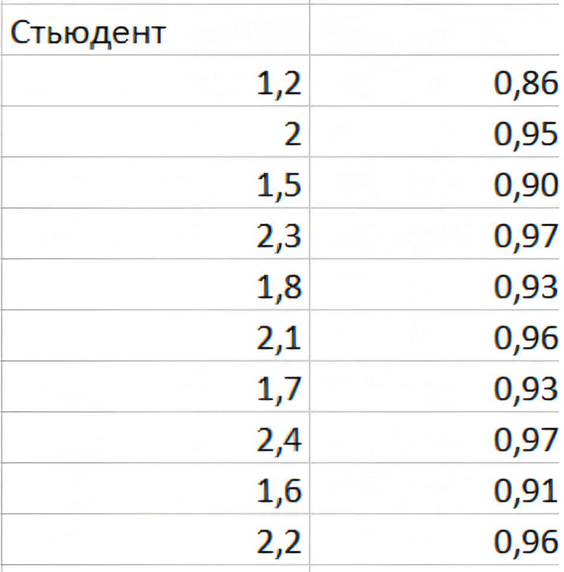

 Найденные значения критерия Фишера.
 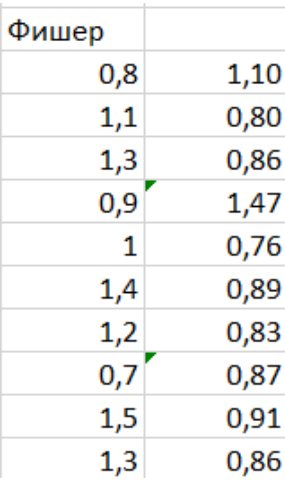
### Кейс 4: Регрессионный, дисперсионный, корреляционный анализ
Задача: изучение пакета анализа.

Метод: однофакторный дисперсионный анализ (ANOVA) для проверки равенства групповых средних (пакет анализа Excel), коэффициент ранговой корреляции Спирмена через функцию КОРРЕЛ(), линейная регрессия с построением уравнения y = kx + b.

Результат: ANOVA: p-value не равно 0, нулевая гипотеза оо равенстве групповых средних отвергается. Корреляция Спирмена: r = 0.753 - умеренная положительная связь между рангами. Уравнение регрессии: y = 1.92x + 100.88.

Выбор дисперсионного анализа в пакете анализа.
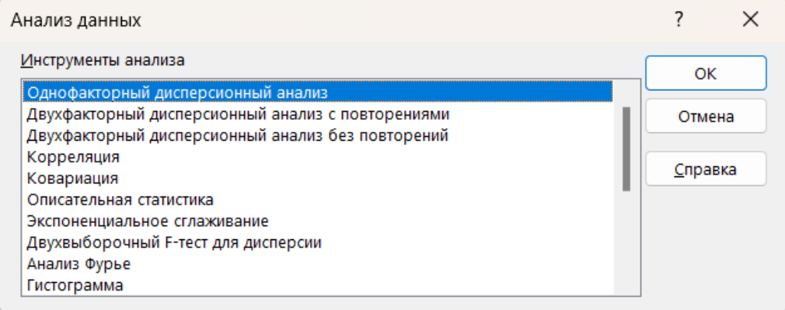

 Заполнение информации об анализе.
 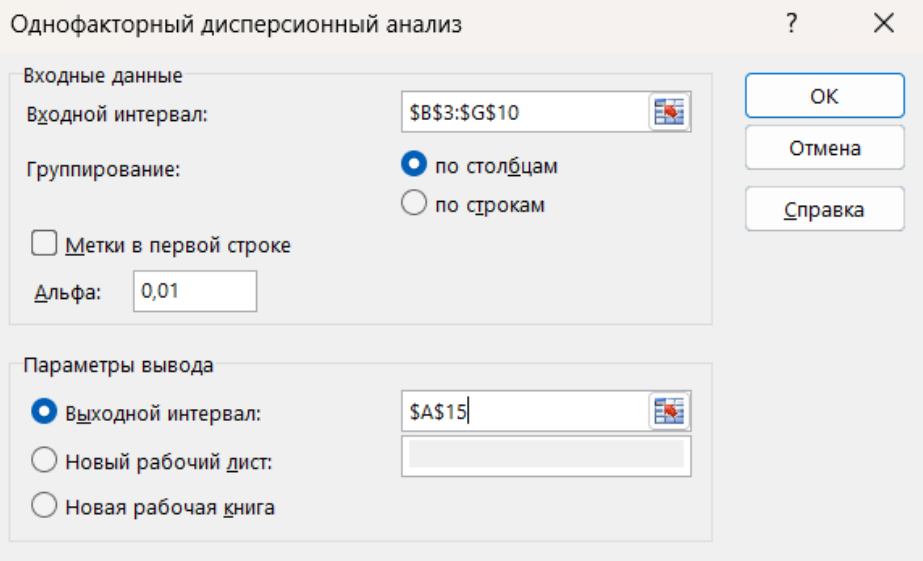

 Формула для коэффициента корреляции.
 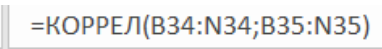

 Результат корреляционного анализа.
 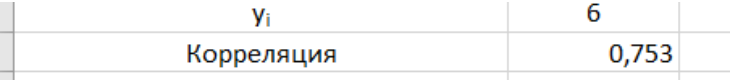

 Выбор регрессионного анализа в папке анализа.
 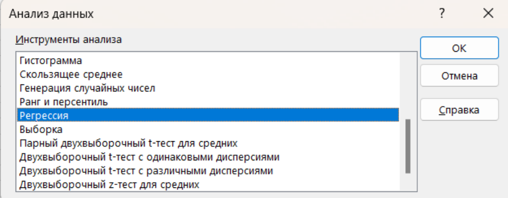

 Ввод параметров и ячейки вывода информации.
 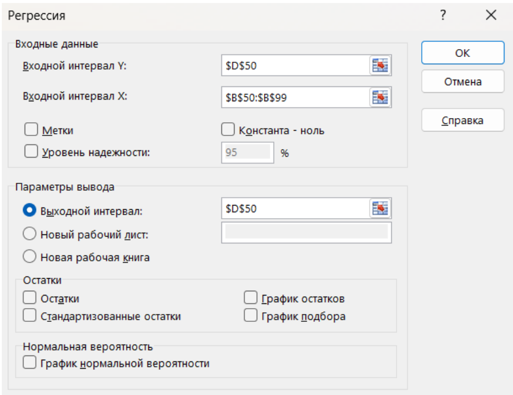

 Итоговые таблицы.
 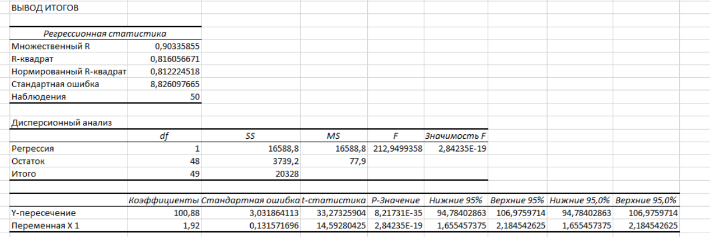
### Кейс 5: Проверка гипотез
Задача: решение более сложных статистических задач в Excel.

Метод: двухвыборочный t-тест с одинаковыми дисперсиями. Сравнение двух методов измерений. Уровень значимости α = 0.1. Нулевая гипотеза - методы обеспечивают одинаковую точность. Альтернативная - методы не обеспечивают одинаковую точность.

Результат: t_выч = -0.251, t_крит = 2.998. |t выч.|<t крит., следовательно, различий нет и выборки можно считать однородными, нулевая гипотеза не отвергается.

Выбор двухвыборочного t-теста с одинаковыми дисперсиями в пакете анализа. 
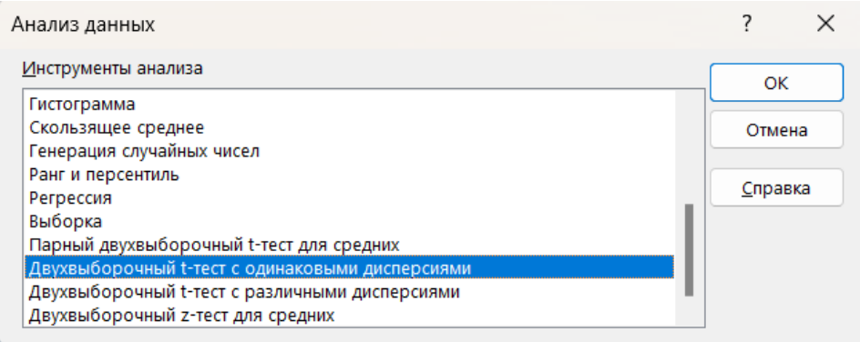

Заполнение полей.
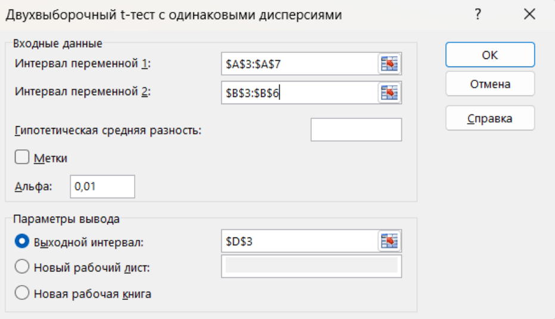

Полученная таблица.
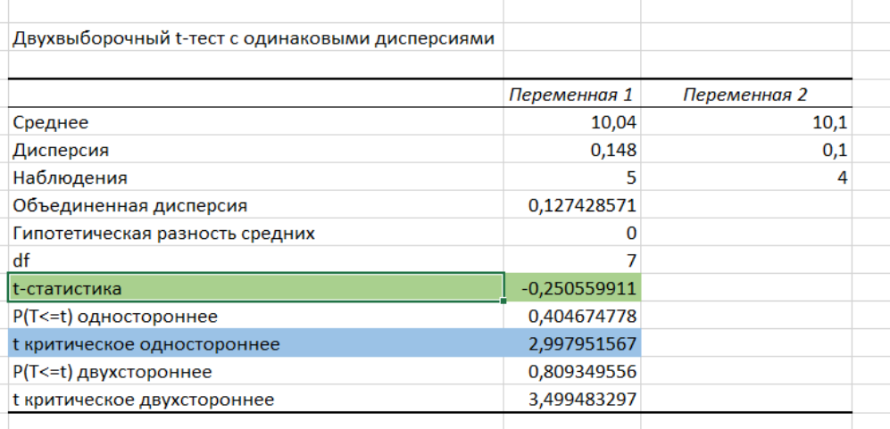

